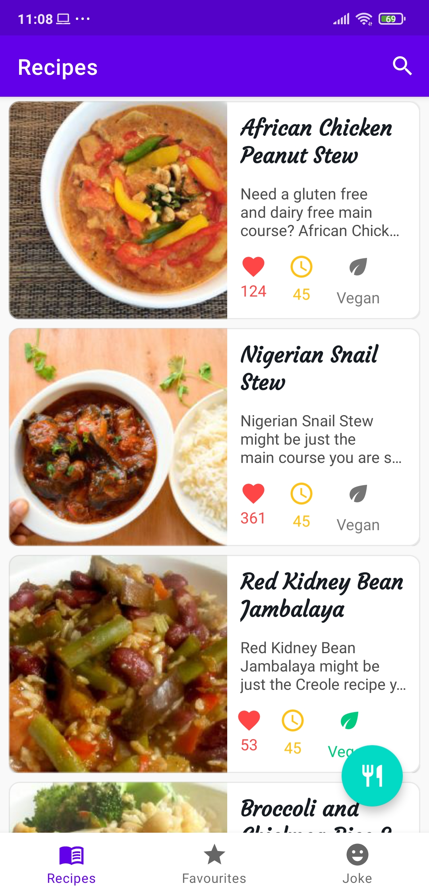
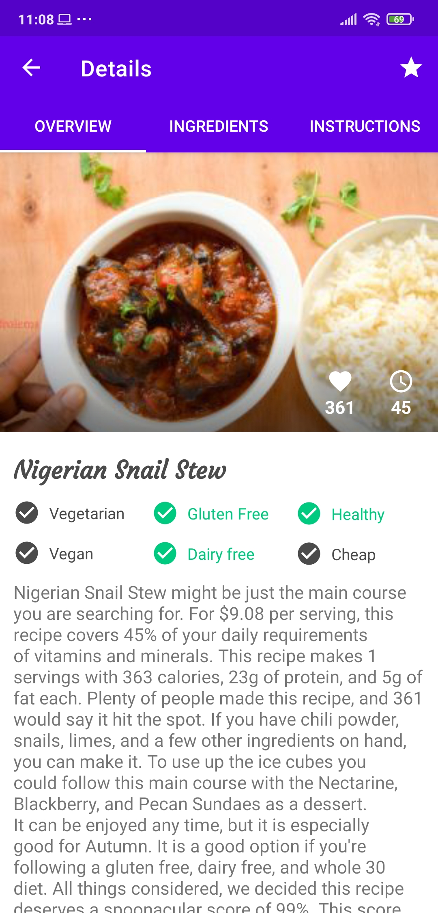
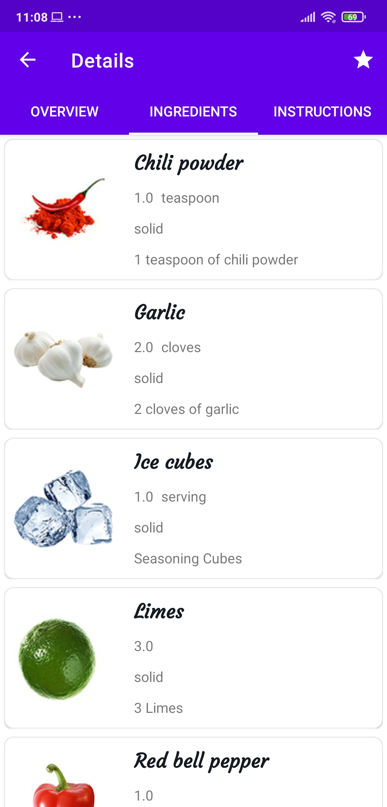
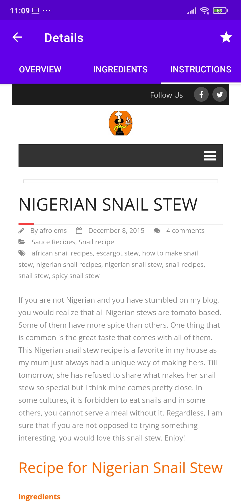
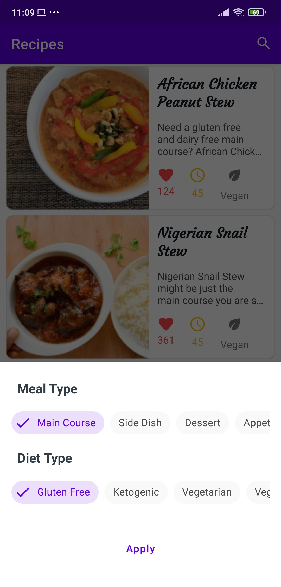
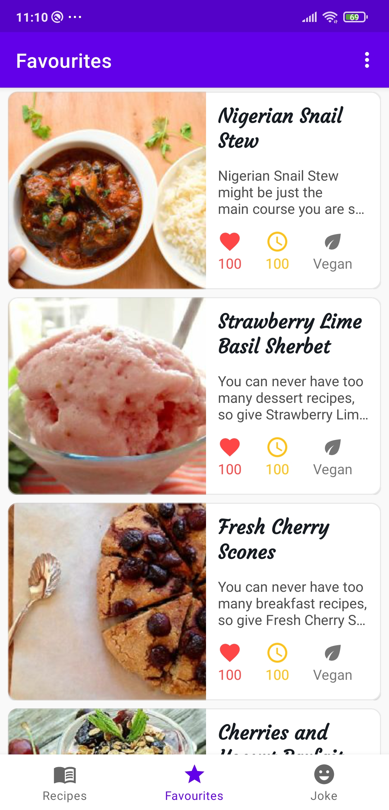
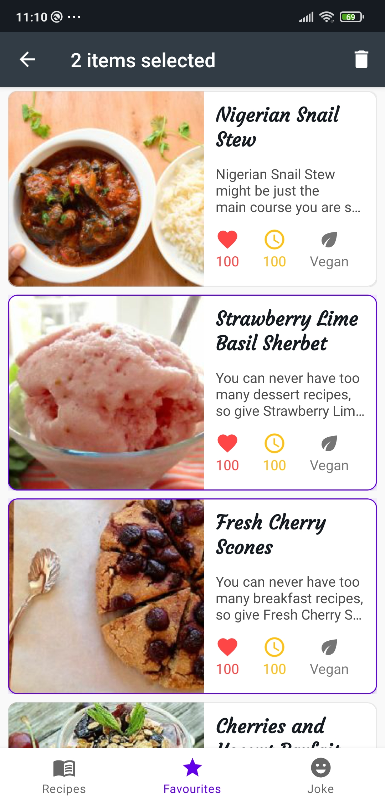
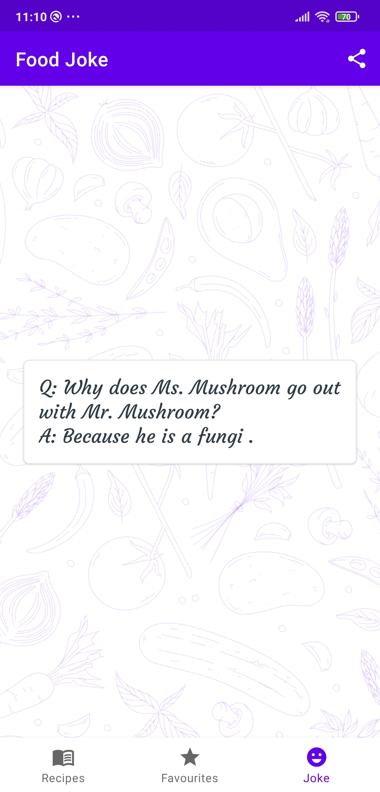
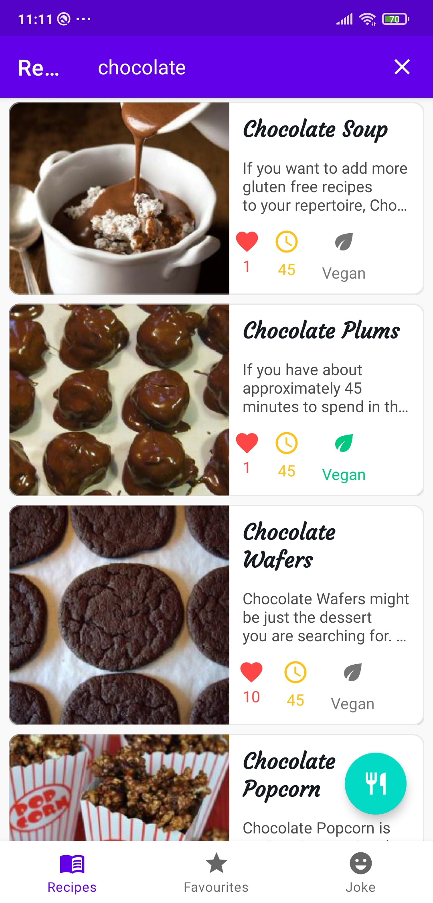

# Foody App
This is a food recipes android app with clean architecture made with the help of [Spoonacular API](https://spoonacular.com/food-api).

- Coroutines
- MVVM
- Dagger Hilt
- Retrofit
- Room
- Navigation Components
- Cache Strategy (Repository Pattern)
- Coroutines Flow
- ViewBinding

# Architecture


# Screenshots
<table>
  <tr>
    <td>Main Screen</td>
     <td>Details: Overview</td>
     <td>Details: Ingredients</td>
  </tr>
  <tr>
    <td></td>
    <td></td>
    <td></td>
  </tr>
 </table>
 <table>
  <tr>
    <td>Details: Instructions</td>
     <td>Select diet type and meal type</td>
     <td>Save recipes to favourites</td>
  </tr>
  <tr>
    <td></td>
    <td></td>
    <td></td>
  </tr>
 </table>
 <table>
  <tr>
    <td>Delete recipes from favourite recipes</td>
     <td>Get a random food joke and share it</td>
     <td>Search for recipes.</td>
  </tr>
  <tr>
    <td></td>
    <td></td>
    <td></td>
  </tr>
 </table>
 
 
## Installation
Clone this repository and import into **Android Studio**
```bash
git clone git@github.com:AkinchanKushwaha/Foody.git
```


## Contributing

1. Fork it
2. Create your feature branch (git checkout -b my-new-feature)
3. Commit your changes (git commit -m 'Add some feature')
5. Push your branch (git push origin my-new-feature)
6. Create a new Pull Request

## Maintainer
This project is mantained by: [Akinchan](https://github.com/AkinchanKushwaha)


# Support
If you like this project then you can follow [me](https://github.com/AkinchanKushwaha) and star⭐ this project.


